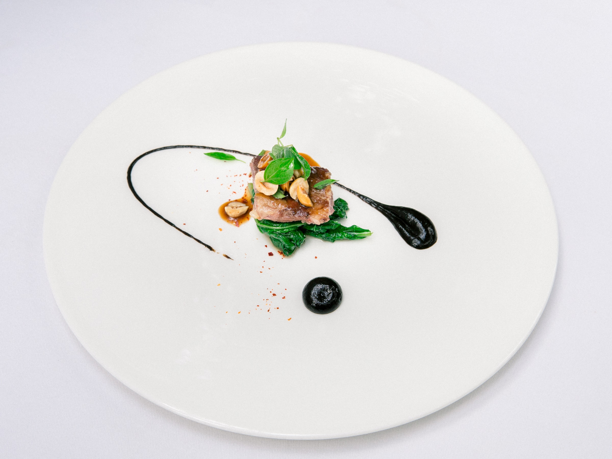
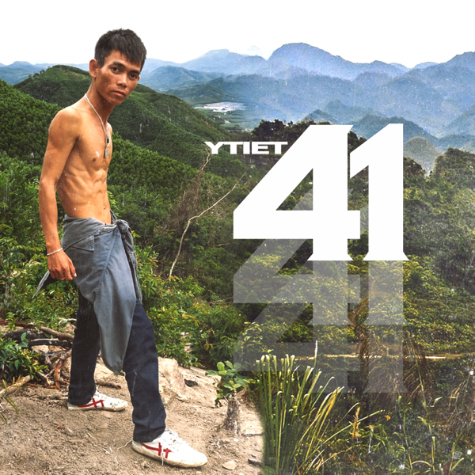
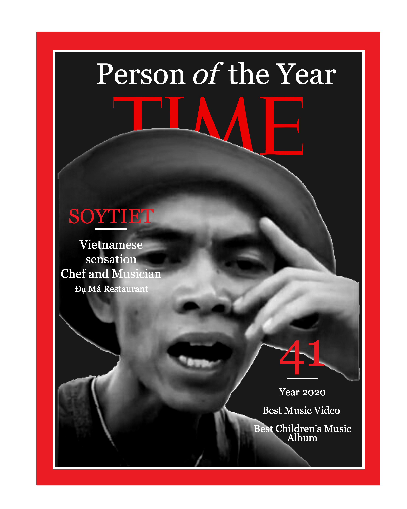

# **Restaurant**
Restaurant project via The Oden Project. 
 

<!-- _class: nth-child(3) -->
By: **David Ho** 

---

# **Design**

### Font
Google Font

* Montserrat 
* Open Sans

## Color

#FFB606;

---

# **Home Page**

### Inspiration
Sumi Restaurant

<ul>
<li style="width: 50%">https://speckyboy.com/restaurant-food-web-design-inspiration/</li>
</ul>

## Image

Unsplash

---

# **Menu**

Menu was created with the idea of Vietnamese cuisine and creating puns with Vietnamese words.

Consist of Starters, Desserts, Entree, and Drinks.

---

# **About**

### Inspiration
Soytiet - became viral during the Covid pandemic and is from Vietnam

Times magazine was created via Pixlr to fit the made up story

## Image

---

# **Contact**
Created simple address page using fake address, reservation, and open hours. 